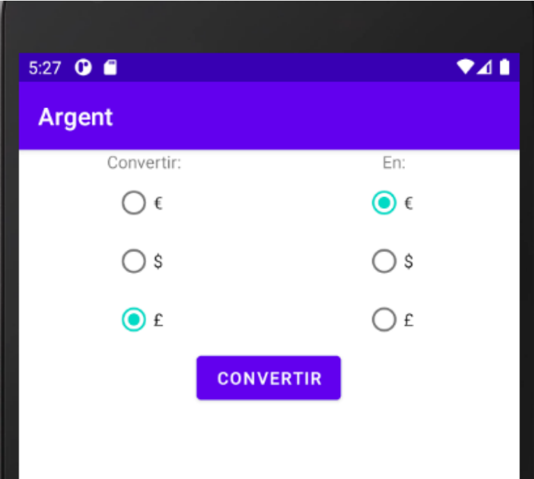
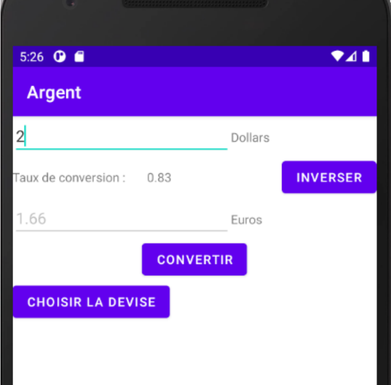

# Interaction Homme-Machine : Application Mobile - Convertisseur de monnaies

L’objectif principal de ce TME est de se familiariser avec l’environnement de développement Android, notament :
• Créer un nouveau projet Android,
• Créer un émulateur pour tester le projet,
• Comprendre l’organisation des composants d’une application Android,
• Composer une interface graphique basique, et
• Y associer des fonctionalités

## Travail effectué
Création d'une application mobile utilisable sur émulateur (par exemple Android Virtual Device) ou avec son propre téléphone. 

L'interface est constituée de deux pages :

- La première page permet de choisir les devises. Cette page est constituée de deux colonnes de radio boutons: la monnaie source, et la monnaie cible ainsi que d'un bouton permettant de confirmer la sélection (et de se rendre donc sur la seconde page).

- La deuxième page permet de faire la conversion en elle-même. Elle est constituée de deux zones de textes permettant d'entrer et de voir les quantités, d'un bouton pour effectuer la conversion, d'un bouton pour changer de devise (qui nous amène sur la première page), et d'un bouton pour inverser les deux devises.
- 
